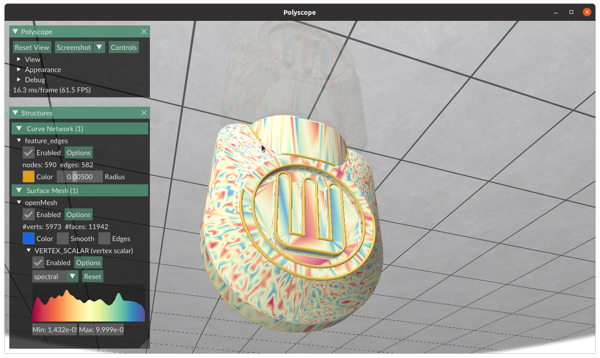

# openMeshPolyscope
A demo code which shows ways to visualize openMesh data structures with polyscope

OpenMesh 8.1 is directly included in the dependencies as source (Only the Core folder).
Polyscope is included as a submodule.

Take a look at the `main.cpp` file to get an idea on how to use openmesh with polyscope

It currently contains the following features
1. Visualizing a mesh
2. Calculating feature edges using openMesh and visualizing the same as a curve network in polyscope
3. Visualizing a random scalar field stored in vertices

If you would like to see anymore examples, feel free to ask.
